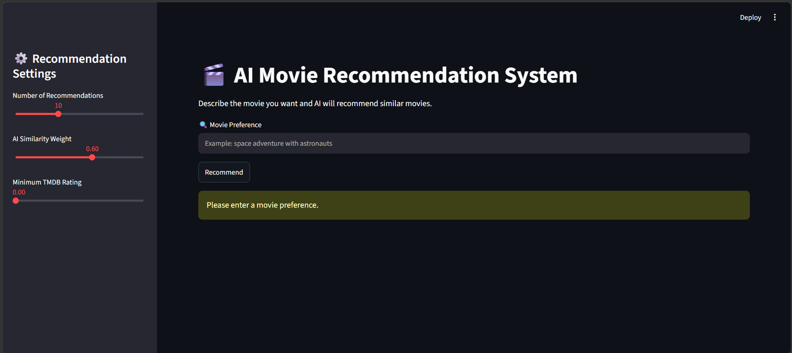
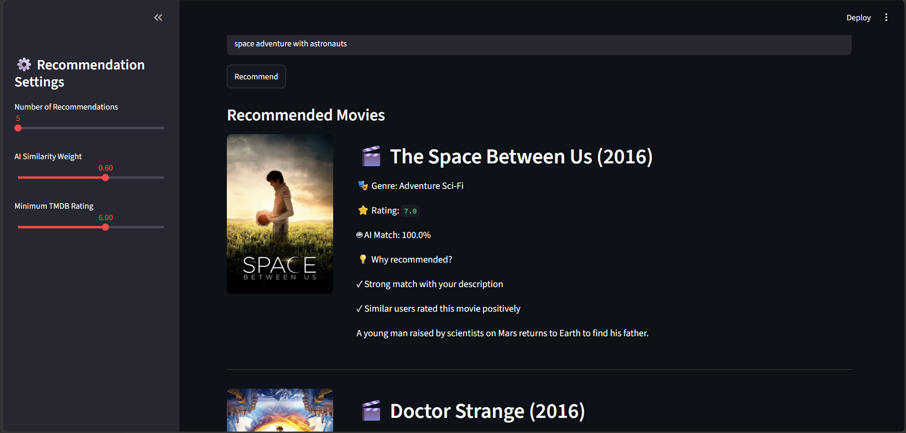

# 🎬 AI Movie Recommendation System

An AI-powered movie recommendation system that combines **semantic search, collaborative filtering, and hybrid ranking** to recommend movies based on natural language user preferences.

The system understands user queries like:

> "A dark psychological thriller with crime investigation"

and recommends relevant movies using Machine Learning and Natural Language Processing techniques.

---

# 🌐 Live Demo

Try the deployed application:

[AI Movie Recommendation System](https://ai-movie-recommendation-system-9zmypcrnp7etambwpmwmmc.streamlit.app/)

---

# 🚀 Features

- AI-powered semantic movie search
- Sentence Transformer based text embeddings
- FAISS vector similarity search
- MovieLens collaborative filtering
- Hybrid recommendation ranking
- TMDB API integration
- Movie posters, ratings, and descriptions
- Explainable recommendation output
- Interactive Streamlit web application

---

# 🏗️ System Architecture

The complete recommendation pipeline:

```text
User Query

↓

Sentence Transformer
(all-MiniLM-L6-v2)

↓

Text Embedding Vector

↓

FAISS Semantic Search

↓

Candidate Movie Retrieval

↓

MovieLens Collaborative Filtering

↓

Hybrid Ranking Model

↓

TMDB API

↓

Streamlit Web Application
```

Detailed architecture:

[View Architecture Diagram](docs/architecture.md)

---

# 🧠 Recommendation Approach

The system combines three major recommendation techniques.

---

## 1. Content-Based Filtering

The system uses movie information such as:

- Movie titles
- Genres
- Semantic meaning of user queries

Sentence Transformer converts text into numerical embeddings.

FAISS then finds movies with similar semantic meaning.

Example:

User:

```
space adventure with astronauts
```

The model searches for movies with similar concepts.

---

## 2. Collaborative Filtering

The system uses MovieLens user rating data.

Movie-to-movie similarity is calculated based on user rating patterns.

Movies that receive similar ratings from users are considered related.

---

## 3. Hybrid Recommendation

The final ranking combines:

```
Final Score =

0.6 × Semantic Similarity

+

0.4 × Rating Similarity
```

Semantic similarity helps understand the user's intent.

Collaborative filtering improves recommendations using historical user preferences.

---

# 🛠️ Technologies Used

## Programming

- Python

## Machine Learning

- Scikit-learn
- Sentence Transformers
- FAISS

## Data Processing

- Pandas
- NumPy

## Deployment

- Streamlit

## External API

- TMDB API

## Dataset

- MovieLens Dataset

---

# 📂 Project Structure

```text
AI-Movie-Recommendation-System

│
├── app
│   └── app.py
│
├── data
│   ├── movies.csv
│   └── ratings.csv
│
├── models
│   ├── movie_embeddings.index
│   ├── movie_embeddings.pkl
│   ├── movie_similarity_top50.pkl
│   └── movies.pkl
│
├── notebooks
│   └── 01_movie_recommendation_basics.ipynb
│
├── screenshots
│   ├── homepage.png
│   └── recommendation_result.png
│
├── docs
│   └── architecture.md
│
├── README.md
└── requirements.txt
```

---

# ⚙️ How It Works

1. User enters a movie preference in natural language.

2. Sentence Transformer converts the query into an embedding vector.

3. FAISS searches the most semantically similar movies.

4. Collaborative filtering calculates movie relationship based on ratings.

5. Hybrid ranking combines both scores.

6. TMDB API retrieves:

- Movie poster
- Rating
- Description

7. Streamlit displays the final recommendations.

---

# 📸 Application Screenshots

## Home Interface




## Recommendation Result



---

# 📦 Installation

Clone the repository:

```bash
git clone https://github.com/diptadaswork21-code/AI-Movie-Recommendation-System.git
```

Move into project directory:

```bash
cd AI-Movie-Recommendation-System
```

Install dependencies:

```bash
pip install -r requirements.txt
```

Create `.env` file:

```env
TMDB_API_KEY=your_api_key_here
```

Run application:

```bash
streamlit run app/app.py
```

---

# 🔮 Future Improvements

- Personalized user profiles
- User watch history integration
- Movie trailer recommendation
- Deep learning recommendation models
- Recommendation evaluation using Precision@K and Recall@K
- Cloud database integration

---

# 👨‍💻 Author

Developed using:

- Machine Learning
- Natural Language Processing
- Recommendation Systems
- AI Application Development